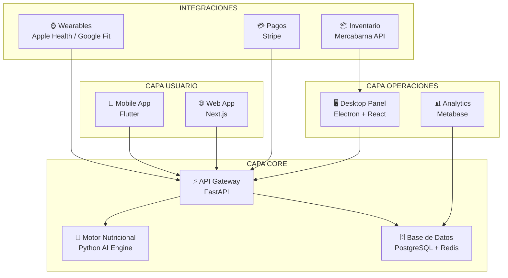
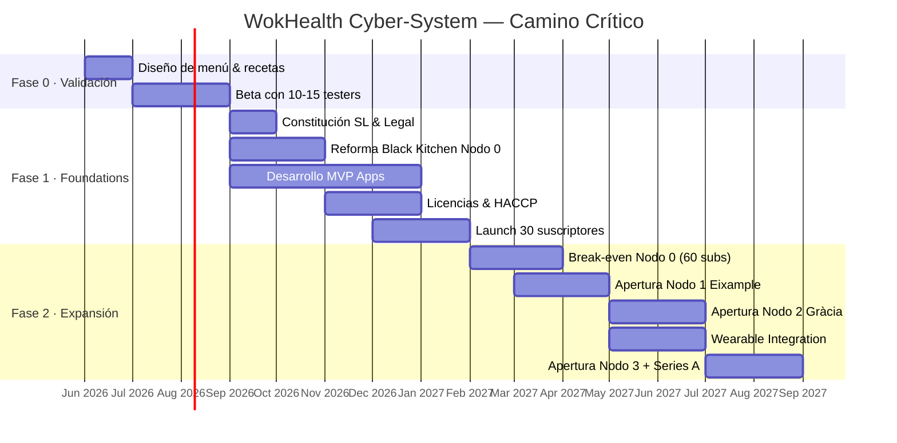

# 🔬 WOKHEALTH CYBER-SYSTEM™

## Business Plan & Tech Roadmap — Documento Ejecutivo v1.0

> **"Fuel Your Machine. Optimize Your Biology."**
> Barcelona · Fundación 2026 · Nicho: Gym & High-Performance Nutrition

---

## 📡 1. ANÁLISIS ESTRATÉGICO & INTELIGENCIA COMPETITIVA

### 1.1 Modelo de Negocio: Subscription-Based Bio-Fuel

| Parámetro | Especificación |
|---|---|
| **Modelo** | Suscripción mensual (renovación automática) |
| **Oferta** | 3 comidas/día + 2 snacks proteicos |
| **Precio Objetivo** | **350 €/mes** (~11,67 €/día · ~3,50 €/comida) |
| **Método de Cocción** | Wok Industrial (Stir-fry de alta temperatura) |
| **Distribución** | Recogida física en Black Kitchens de proximidad |
| **Filosofía** | Zero Waste · Envases de vidrio retornables · Frescura diaria |
| **Target Primario** | Hombres 70-90kg / Mujeres 40-60kg (gramajes adaptativos) |

### 1.2 Mapa Competitivo — Barcelona 2026

| Competidor | Precio/Plato | Modelo | Fresh/Frozen | Macros | Debilidad WokHealth Explota |
|---|---|---|---|---|---|
| **Wetaca** | 5-7 € | Suscripción semanal | ❄️ Refrigerado (5 días) | Básicos | No es fresco diario, sin foco fitness |
| **Knoweats** | 7-8,25 € | Compra libre | ❄️ Refrigerado | ✅ Detallados | Sin suscripción, caro, delivery |
| **The Healthiest Choice** | 8-10 € | Pedido diario | 🟢 Fresco | ✅ 40/30/30 | Precio alto, sin escala |
| **Mercadona "Listo"** | 3-5 € | Retail | ❄️ Procesado | ❌ No | Ultra-procesado, sin personalización |
| **Fast Food Gym** | 8-12 € | Por pedido | Variable | Variable | Inconsistente, sin sistema |
| **🔥 WokHealth** | **~3,50 €** | **Suscripción mensual** | **🟢 Fresco diario** | **✅ Precisión por peso** | **— NOSOTROS —** |

### 1.3 Matriz DAFO (SWOT) — Cyber-Scan

#### 💪 FORTALEZAS
- **Fresh vs. Frozen**: Cocina diaria al wok = máxima frescura y sabor superior
- **Precio disruptivo**: 3,50 €/comida vs. 7-10 € de la competencia
- **Zero delivery cost**: Recogida elimina el 15-30% de comisiones de plataformas
- **Precisión biométrica**: Gramajes ajustados por peso corporal del suscriptor
- **Wok = Velocidad**: Tiempo de cocción 3-7 min por ración = alto throughput
- **Zero Waste**: Envases retornables reducen costes y atraen al consumidor eco

#### ⚠️ DEBILIDADES
- **Sin delivery**: Barrera para usuarios que valoran comodidad total
- **Dependencia geográfica**: Radio de acción limitado al nodo de cocina
- **Marca nueva**: Sin reconocimiento vs. Wetaca/Knoweats
- **Inversión inicial tech**: Desarrollo de ecosistema digital desde cero

#### 🚀 OPORTUNIDADES
- **Nicho desatendido**: No hay meal-prep al wok con suscripción en BCN
- **Wearable boom**: Integración con Apple Health/Google Fit = diferenciación tech
- **Comunidad gym BCN**: Alta densidad de gimnasios premium (DIR, Holmes Place, McFIT)
- **Mercabarna**: Acceso a precios mayoristas frescos diarios
- **Regulación favorable**: Barcelona permite dark kitchens en zonas industriales

#### 🛑 AMENAZAS
- **Entrada de grandes players**: Wetaca/Knoweats podrían lanzar línea "fresh"
- **Regulación municipal**: Barcelona ha restringido ubicaciones de dark kitchens
- **Inflación alimentaria**: Volatilidad de precios de materia prima
- **Churn de suscriptores**: Fatiga de menú o cambio de rutinas

---

## 🖥️ 2. ECOSISTEMA DIGITAL — SOFTWARE STACK

### 2.1 Arquitectura del Cyber-System

### 2.2 Módulos del Ecosistema

#### 📱 Mobile App + Web App (Flutter / Next.js)

| Feature | Descripción | Prioridad |
|---|---|---|
| **Onboarding Biométrico** | Peso, altura, objetivo (bulk/cut/maintain), alergias | P0 |
| **Dashboard de Macros** | Visualización diaria de proteína/carbs/grasas consumidas | P0 |
| **Selector de Menú** | Menú semanal rotativo con swap de platos | P0 |
| **QR de Recogida** | Código único por pedido diario para pickup en nodo | P0 |
| **Pagos & Suscripción** | Stripe integration, gestión de plan, pausa/cancelación | P0 |
| **Wearable Sync** | Apple Health / Google Fit → ajuste automático de raciones | P1 |
| **Gamificación** | Streaks de recogida, badges, ranking de comunidad | P2 |
| **Chat Nutricional** | Asistente AI para consultas sobre macros y sustituciones | P2 |

#### 🖥️ Desktop Panel — Command Center (Electron + React)

| Módulo | Función |
|---|---|
| **Order Matrix** | Vista diaria de todos los pedidos por nodo, hora y tipo |
| **Inventory Engine** | Stock en tiempo real, alertas de reposición, pedido a Mercabarna |
| **Cook Timer** | Temporizadores por estación de wok con secuencia óptima |
| **Subscriber Analytics** | Churn prediction, LTV, preferencias de menú, heatmaps |
| **Kitchen Performance** | Tiempos de preparación, waste tracking, eficiencia por cocinero |

### 2.3 Estimación de Costes de Desarrollo

| Componente | Tecnología | Tiempo | Coste Estimado |
|---|---|---|---|
| Mobile App MVP | Flutter | 3-4 meses | 18.000 - 25.000 € |
| Web App | Next.js | 2-3 meses | 12.000 - 18.000 € |
| Backend API | FastAPI + PostgreSQL | 2-3 meses | 15.000 - 20.000 € |
| Desktop Panel | Electron + React | 2 meses | 10.000 - 15.000 € |
| Motor Nutricional AI | Python | 1-2 meses | 8.000 - 12.000 € |
| Wearable Integration | HealthKit/Google Fit | 1 mes | 5.000 - 8.000 € |
| **TOTAL DESARROLLO** | | **8-12 meses** | **68.000 - 98.000 €** |

> [!TIP]
> **Estrategia de reducción de costes**: Desarrollar in-house con un equipo de 2 devs full-stack + 1 designer reduce el coste a ~45.000-60.000 € en 6-8 meses. El MVP mínimo viable (Mobile + API + Panel básico) puede estar listo en **3-4 meses por ~30.000 €**.

---

## 🏭 3. INFRAESTRUCTURA FÍSICA — BLACK KITCHEN NODES

### 3.1 Blueprint de Unidad Estándar (60-80 m²)

| Zona | Equipamiento | Coste Estimado |
|---|---|---|
| **Zona de Wok** (x3 estaciones) | Wok industrial inducción 12KW + campana extractora | 9.000 - 15.000 € |
| **Zona de Prep** | 2x mesas acero inox + cortadoras industriales | 3.000 - 5.000 € |
| **Cámara Frigorífica** | Walk-in cooler 6m³ + congelador industrial | 8.000 - 12.000 € |
| **Almacén Seco** | Estanterías industriales + contenedores herméticos | 1.500 - 2.500 € |
| **Zona de Empaquetado** | Báscula de precisión + envasadora + etiquetadora | 3.000 - 4.000 € |
| **Zona de Recogida** | Mostrador + pantalla de pedidos + lector QR | 2.000 - 3.000 € |
| **Instalaciones** | Fontanería industrial + eléctrica + ventilación HVAC | 8.000 - 15.000 € |
| **Tech Stack Cocina** | Tablets KDS + POS + cámaras seguridad + WiFi | 3.000 - 5.000 € |
| **TOTAL EQUIPAMIENTO** | | **37.500 - 61.500 €** |

### 3.2 Costes de Apertura por Nodo

| Concepto | Coste |
|---|---|
| Equipamiento (tabla anterior) | 37.500 - 61.500 € |
| Reforma del local | 15.000 - 25.000 € |
| Licencias y permisos (Actividad + Sanitaria + HACCP) | 3.000 - 5.000 € |
| Depósito alquiler (3 meses) | 4.500 - 9.000 € |
| Stock inicial materia prima | 2.000 - 3.000 € |
| Marketing de lanzamiento del nodo | 3.000 - 5.000 € |
| **TOTAL POR NODO** | **65.000 - 108.500 €** |

### 3.3 Plan de Expansión Multi-Nodo (Barcelona)

| Fase | Zona | Justificación | Timeline |
|---|---|---|---|
| **Nodo 0** | Zona Industrial (Poblenou/22@) | Alquiler bajo, regulación favorable, proximidad gym | Mes 1-4 |
| **Nodo 1** | Eixample (Dreta) | Mayor densidad de gimnasios premium (DIR, Holmes) | Mes 8-10 |
| **Nodo 2** | Gràcia | Comunidad health-conscious, alto poder adquisitivo | Mes 12-14 |
| **Nodo 3** | Sant Martí / Glòries | Zona residencial en auge, McFIT, CrossFit boxes | Mes 16-18 |

---

## 💰 4. MATRIZ FINANCIERA

### 4.1 CapEx Inicial (Lanzamiento Completo)

| Categoría | Mínimo | Máximo |
|---|---|---|
| Desarrollo Software (MVP) | 30.000 € | 45.000 € |
| Primera Black Kitchen (Nodo 0) | 65.000 € | 108.500 € |
| Branding & Web Corporativa | 5.000 € | 8.000 € |
| Legal (Constitución SL + contratos) | 3.000 € | 5.000 € |
| Buffer de contingencia (15%) | 15.450 € | 24.975 € |
| **TOTAL CapEx** | **118.450 €** | **191.475 €** |

### 4.2 OpEx Mensual (1 Nodo Operativo — 50 suscriptores)

| Concepto | Coste/Mes | Notas |
|---|---|---|
| **Materia prima (Mercabarna)** | 6.500 - 8.000 € | ~4,50 €/día por suscriptor (3 comidas + snacks) |
| **Alquiler local** | 1.500 - 3.000 € | Zona industrial/semi-industrial BCN |
| **Sueldos** (2 cocineros + 1 prep) | 6.300 € | 2.100 € coste empresa x 3 |
| **Suministros** (luz, agua, gas) | 800 - 1.200 € | Woks inducción = eficiencia energética |
| **Envases retornables** (amortización) | 300 - 500 € | Reposición de vidrio roto/perdido |
| **Servidores & Tech** | 200 - 400 € | Cloud (AWS/GCP) + dominio + servicios |
| **Seguros** | 250 - 400 € | RC + mercancía + local |
| **Marketing digital** | 1.000 - 2.000 € | Instagram, Google Ads, influencers gym |
| **Gestoría & contabilidad** | 200 - 300 € | Asesoría fiscal y laboral |
| **Mantenimiento** | 200 - 400 € | Equipos, limpieza industrial |
| **TOTAL OpEx** | **17.250 - 22.500 €** |  |

### 4.3 Proyección de Ingresos & Beneficios por Nodo

| Métrica | 30 Suscriptores | 50 Suscriptores | 100 Suscriptores |
|---|---|---|---|
| **Ingresos mensuales** | 10.500 € | 17.500 € | 35.000 € |
| **OpEx estimado** | 13.500 € | 19.500 € | 30.000 € |
| **Resultado neto** | **-3.000 €** ❌ | **-2.000 €** ⚠️ | **+5.000 €** ✅ |
| **Margen neto** | -28,6% | -11,4% | +14,3% |
| **Break-even estimado** | — | ~60 subs | — |

> [!IMPORTANT]
> **Break-Even Point**: Se estima en **~60 suscriptores por nodo**. Por debajo de esta cifra, el nodo opera en pérdidas. La estrategia debe priorizar alcanzar 60 subs antes de abrir un segundo nodo.

### 4.4 Coste de Escalar (Nuevo Nodo)

| Concepto | Coste |
|---|---|
| CapEx del nuevo nodo | 65.000 - 108.500 € |
| Desarrollo tech adicional (adaptación) | 5.000 - 8.000 € |
| Personal adicional (2 cocineros + 1 prep) | +6.300 €/mes |
| Marketing de zona | 3.000 - 5.000 € |
| **Total inversión por expansión** | **73.000 - 121.500 €** |

---

## 🏠 5. BLACK KITCHEN PROPIA vs. HOME-BASED

| Factor | 🏭 Black Kitchen Propia | 🏠 Home-Based |
|---|---|---|
| **CapEx Inicial** | ❌ Alto (65-108K €) | ✅ Bajo (5-15K €) |
| **Capacidad de producción** | ✅ 80-150 comidas/día | ❌ 15-30 comidas/día |
| **Licencias sanitarias** | ✅ Cumplimiento total HACCP | ⚠️ Zona gris legal |
| **Escalabilidad** | ✅ Replicable, multi-nodo | ❌ Techo físico rápido |
| **Imagen profesional** | ✅ Premium, confianza inversor | ❌ Percepción artesanal |
| **Punto de recogida** | ✅ Zona dedicada con horarios | ❌ Incómodo para clientes |
| **Eficiencia operativa** | ✅ Layout optimizado, flujo industrial | ❌ Espacio limitado, improvisado |
| **Seguro & responsabilidad** | ✅ Cubierto por seguro comercial | ⚠️ Complejo, seguro hogar no cubre |
| **Coste por comida** | ✅ Más bajo a escala (+50 subs) | ✅ Más bajo a micro-escala (<20 subs) |
| **Riesgo personal** | ✅ Separado de vida personal | ❌ Tu casa = tu negocio |

> [!WARNING]
> **Veredicto**: Home-based es viable SOLO para Fase 0 (Proto-Kitchen con 10-15 clientes de validación). Para cualquier operación seria con inversores y crecimiento, la **Black Kitchen propia es obligatoria** por cumplimiento legal y escalabilidad.

---

## 🗺️ 6. ROADMAP DE IMPLEMENTACIÓN

### Fase 0: PROTO-KITCHEN — Validación (Mes 1-3)

| Sprint | Objetivo | Entregable |
|---|---|---|
| **S0.1** (Sem 1-2) | Diseño de menú base (10 recetas wok) | Carta validada con macros calculados |
| **S0.2** (Sem 3-4) | Cocina manual (casa/coworking cocina) | Primeras 10-15 comidas de test |
| **S0.3** (Mes 2) | Captación de 10 beta-testers (gimnasios locales) | 10 suscriptores pagando 250 € |
| **S0.4** (Mes 3) | Feedback loop + iteración de menú | NPS > 8, retention > 80% |
| **💰 Budget** | | **3.000 - 5.000 €** |

### Fase 1: CYBER-FOUNDATIONS — Build & Launch (Mes 4-8)

| Sprint | Objetivo | Entregable |
|---|---|---|
| **S1.1** (Mes 4) | Constitución SL + búsqueda de local | Empresa legal + local firmado |
| **S1.2** (Mes 4-5) | Reforma + equipamiento Black Kitchen | Nodo 0 operativo |
| **S1.3** (Mes 4-7) | Desarrollo MVP (Mobile + API + Panel) | Apps en TestFlight/Beta |
| **S1.4** (Mes 6-7) | Licencias HACCP + sanitaria + actividad | Todo en regla legal |
| **S1.5** (Mes 7-8) | Launch con 30 suscriptores objetivo | Marketing gym partnerships |
| **💰 Budget** | | **118.000 - 190.000 €** |

### Fase 2: MULTI-NODE EXPANSION (Mes 9-18)

| Sprint | Objetivo | Entregable |
|---|---|---|
| **S2.1** (Mes 9-10) | Alcanzar 60+ subs en Nodo 0 (break-even) | Rentabilidad operativa |
| **S2.2** (Mes 10-11) | Apertura Nodo 1 (Eixample) | Segundo punto de recogida |
| **S2.3** (Mes 12-14) | Apertura Nodo 2 (Gràcia) | Tercer punto operativo |
| **S2.4** (Mes 14-16) | Lanzamiento wearable integration v1 | Apple Health / Google Fit sync |
| **S2.5** (Mes 16-18) | Apertura Nodo 3 (Sant Martí) + Series A prep | 4 nodos, 200+ subs totales |
| **💰 Budget** | | **220.000 - 365.000 €** |

---

## 📊 7. KPIs CRÍTICOS — Panel de Control Ejecutivo

| KPI | Definición | Target Fase 1 | Target Fase 2 |
|---|---|---|---|
| **LTV** (Lifetime Value) | Ingresos totales de un suscriptor durante su vida útil | 2.100 € (6 meses) | 4.200 € (12 meses) |
| **CAC** (Coste de Adquisición) | Coste total de marketing / nuevos suscriptores | < 50 € | < 35 € |
| **LTV:CAC Ratio** | Eficiencia de adquisición | > 40:1 | > 120:1 |
| **Monthly Churn** | % de suscriptores que cancelan al mes | < 10% | < 6% |
| **Food Waste %** | % de materia prima desperdiciada | < 5% | < 3% |
| **Meal Cost Ratio** | Coste de materia prima / precio de venta | < 40% | < 35% |
| **NPS** (Net Promoter Score) | Satisfacción del cliente (-100 a +100) | > 50 | > 70 |
| **Daily Throughput** | Comidas producidas por nodo/día | 90 (30 subs) | 300 (100 subs) |
| **Pickup Compliance** | % de recogidas realizadas en horario | > 90% | > 95% |
| **Subscriber Density** | Suscriptores por km² de radio de nodo | > 15 | > 40 |

---

## 🔮 CONCLUSIÓN EJECUTIVA

> **WokHealth Cyber-System** no es un servicio de comida más. Es una **infraestructura de optimización biológica** que fusiona la eficiencia del wok industrial con la precisión de datos biométricos.

**Ventaja competitiva nuclear**: Mientras la competencia envía comida refrigerada de 3-5 días de antigüedad a 7-10 €/plato con márgenes erosionados por delivery, WokHealth ofrece **comida fresca del día a 3,50 €/plato** con márgenes protegidos por el modelo de recogida.

**Inversión total estimada** (18 meses, 4 nodos):

| Fase | Inversión | Suscriptores Target | Revenue Mensual |
|---|---|---|---|
| Fase 0 | 5.000 € | 15 | 3.750 € |
| Fase 1 | 155.000 € | 60 | 21.000 € |
| Fase 2 | 365.000 € | 240 | 84.000 € |
| **TOTAL** | **~525.000 €** | **240+** | **84.000 €/mes** |

> [!CAUTION]
> **Riesgo principal**: No alcanzar los 60 suscriptores por nodo necesarios para el break-even. Mitigación: no abrir Nodo 1 hasta que Nodo 0 sea rentable durante 2 meses consecutivos.

---

*Documento generado el 8 de Mayo de 2026 · WokHealth Cyber-System™ · Barcelona, España*
*Clasificación: Confidencial — Solo para uso interno y presentación a inversores*
# WP-WEB
